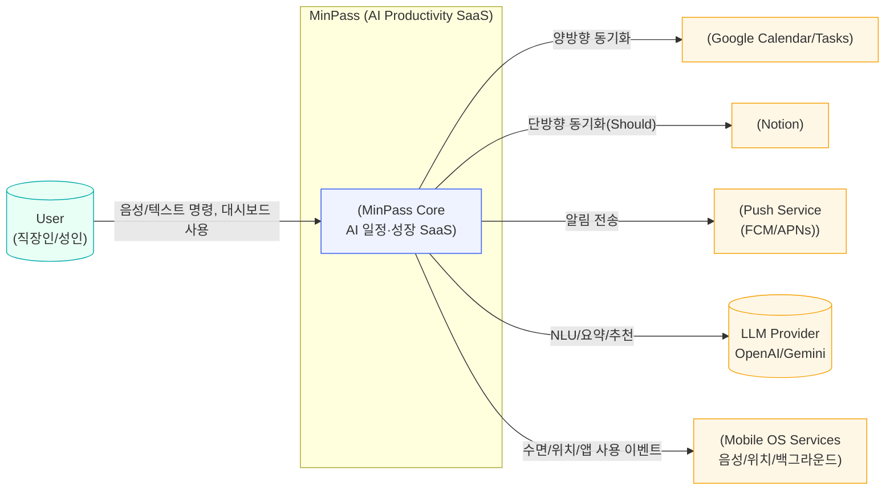
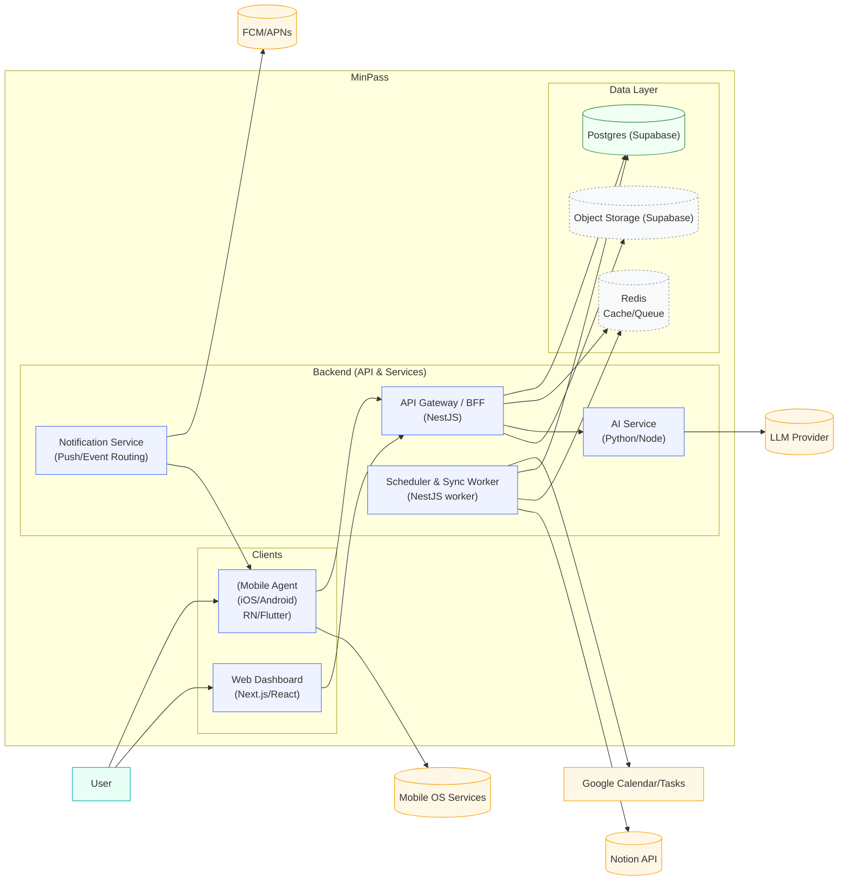
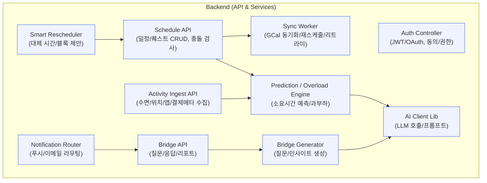
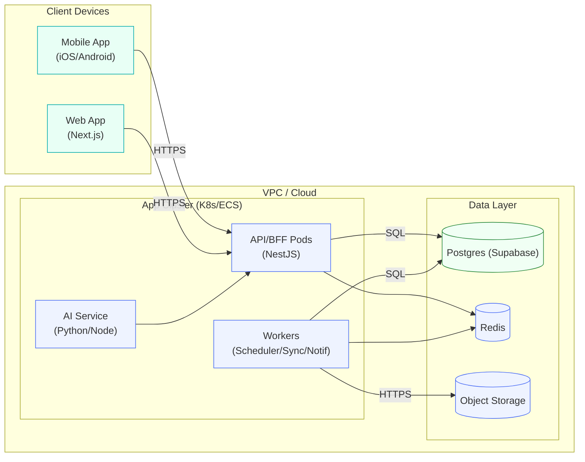

# 1) C4 Level 1 – System Context

---

# 2) C4 Level 2 – Container Diagram

---

# 3) C4 Level 3 – Component Diagram (Backend)

---

# 4) Deployment (간단 뷰)

---

## 핵심 요약

- **경계**: Mobile/Web ↔ BFF ↔ Services(Worker/AI/Notif) ↔ Data(Postgres/Redis/Object)
- **동기화 패턴**: 사용자 액션은 **즉시응답 + 비동기 동기화**(큐/워커, 재시도/백오프)
- **LLM 비용/지연 가드**: 캐싱(요약/템플릿), 토큰 한도, 중요 경로는 규칙 기반 폴백
- **개인정보 처리**: 동의기반 옵트인 데이터만 수집, 민감 필드 마스킹/분리 저장
- **관측성**: 분산 트레이싱(trace-id), p95/오류율/큐 적재량 대시보드
