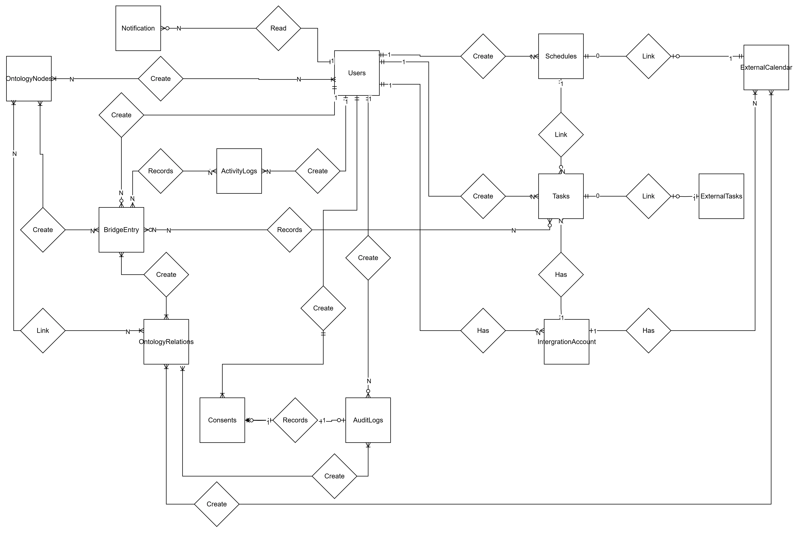
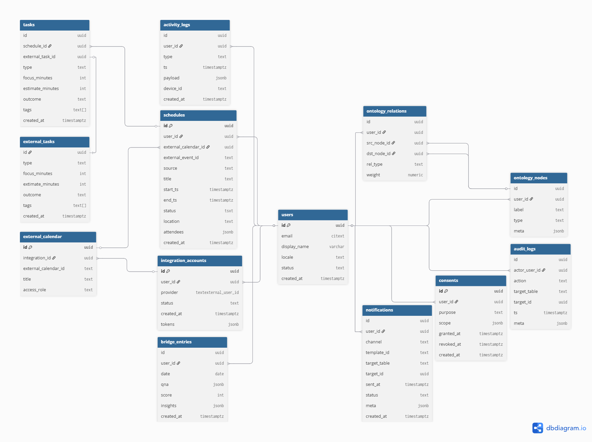
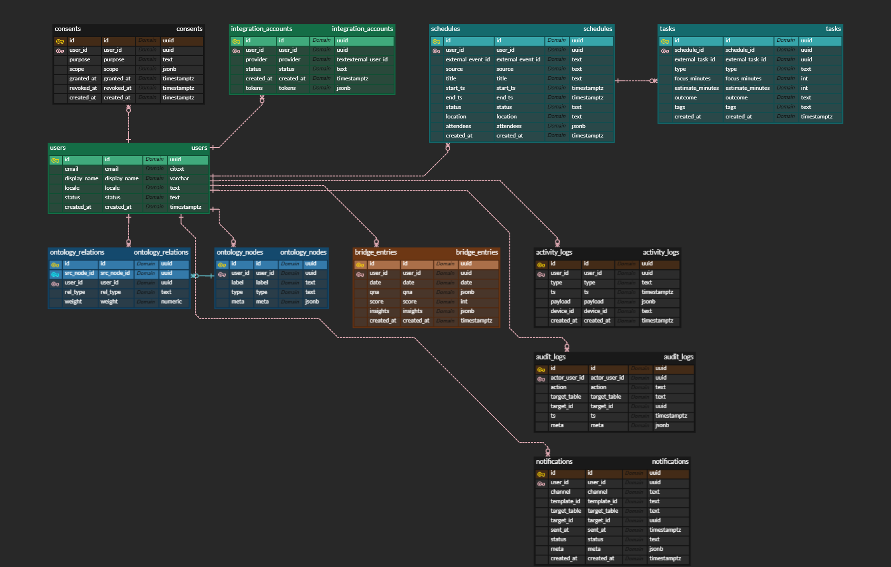

# 1) 개념 ERD (Conceptual)

| 엔터티                             | 설명                                    | 주요 관계                                                                                                                                          |
| ---------------------------------- | --------------------------------------- | -------------------------------------------------------------------------------------------------------------------------------------------------- |
| **User**                           | 서비스 이용자(직장인/성인)              | 1–N **Consent**,   1–N **Schedule**,  1–N **ActivityLog**,  1–N **BridgeEntry**,  1–N **Notification**,  1–N **IntegrationAccount** |
| **Consent**                        | 데이터 처리 목적 별 동의 이력           | N–1 **User**                                                                                                                                       |
| **Schedule**                       | 캘린더 일정(이벤트) + 퀘스트 컨테이너   | N–1 **User**,   1–N **Quest**,  0–1 **ExternalCalendar**                                                                                     |
| **Quest**                          | 실행 단위 태스크(Deep Work, 액션아이템) | N–1 **Schedule**                                                                                                                                   |
| **ActivityLog**                    | 활동 이벤트(수면/위치/앱/결제메타)      | N–1 **User**                                                                                                                                       |
| **BridgeEntry**                    | 저녁 회고(질문/응답/인사이트)           | N–1 **User**                                                                                                                                       |
| **Notification**                   | 푸시/알림 발송 기록                     | N–1 **User**,                                                                                                                                      |
| (옵션) N–1 **Schedule**/ **Quest** |
| **IntegrationAccount**             | 외부 서비스 연결(구글, 노션 등)         | N–1 **User**,                                                                                                                                      |
| 1–N **ExternalCalendar**           |
| **ExternalCalendar**               | 외부 캘린더 자원(캘린더ID/소유권)       | N–1 **IntegrationAccount**,                                                                                                                        |
| 1–N **Schedule**(링크)             |
| **AuditLog**                       | 관리/중요 행위 감사 기록                | (옵션) N–1 **User**                                                                                                                                |
| _(선택)_ **OntologyNode**          | 목표/자원/행동 그래프 노드              | N–1 **User**,                                                                                                                                      |
| N–N **OntologyRelation**           |
| _(선택)_ **OntologyRelation**      | 노드 간 관계(타입/가중치)               | N–N **OntologyNode**                                                                                                                               |

# 2) 논리 ERD (Logical)

속성, PK/FK, 카디널리티, 선택성

## 2.1 핵심 테이블

| 테이블                 | 주요 속성(예시)                                                                                                                                   | PK  | FK                                                                       | 카디널리티 / 선택성                     |
| ---------------------- | ------------------------------------------------------------------------------------------------------------------------------------------------- | --- | ------------------------------------------------------------------------ | --------------------------------------- |
| **User**               | id, email, display_name, locale, created_at, status                                                                                               | id  | -                                                                        | -                                       |
| **Consent**            | id, user_id, purpose(enum), scope(jsonb), granted_at, revoked_at                                                                                  | id  | user_id → User.id                                                        | User 1–N Consent (옵션 적)              |
| **IntegrationAccount** | id, user_id, provider(enum: GOOGLE, NOTION), external_user_id, status, created_at                                                                 | id  | user_id → User.id                                                        | User 1–N IntegrationAccount             |
| **ExternalCalendar**   | id, integration_id, external_calendar_id, title, access_role                                                                                      | id  | integration_id → IntegrationAccount.id                                   | IntegrationAccount 1–N ExternalCalendar |
| **Schedule**           | id, user_id, external_calendar_id?, title, start_ts, end_ts, status(enum), source(enum: APP/GCAL), external_event_id?, location, attendees(jsonb) | id  | user_id → User.id, external_calendar_id → ExternalCalendar.id (nullable) | User 1–N Schedule                       |
| **Quest**              | id, schedule_id, type(enum: DEEPWORK/ACTION/ROUTINE), focus_minutes, estimate_minutes, outcome(enum: DONE/CANCEL/DEFER), tags(text[])             | id  | schedule_id → Schedule.id                                                | Schedule 1–N Quest                      |
| **ActivityLog**        | id, user_id, type(enum: SLEEP_START/SLEEP_END/LOCATION/APP_USAGE/PAYMENT_META), ts, payload(jsonb), device_id                                     | id  | user_id → User.id                                                        | User 1–N ActivityLog                    |
| **BridgeEntry**        | id, user_id, date, qna(jsonb), score(int), insights(jsonb)                                                                                        | id  | user_id → User.id                                                        | User 1–N BridgeEntry                    |
| **Notification**       | id, user_id, channel(enum: PUSH/EMAIL), template_id, target_ref(table_name,id), sent_at, status(enum: SENT/DELIVERED/OPENED/FAILED), meta(jsonb)  | id  | user_id → User.id                                                        | User 1–N Notification                   |
| **AuditLog**           | id, actor_user_id?, action, target(table_name,id), ts, meta(jsonb)                                                                                | id  | actor_user_id → User.id (nullable)                                       | User 0–N AuditLog                       |

- ERD
  

## 2.2 제약/비즈니스 규칙(논리)

- `Schedule(start_ts) < end_ts` 강제.
- `Quest.focus_minutes`는 5–300 범위 권장.
- `Consent`는 `(user_id, purpose)` 최신 레코드만 활성( revoked_at IS NULL ).
- `ActivityLog`의 `payload` 스키마는 `type`별 밸리데이션(예: LOCATION: {lat, lng, accuracy}).
- `Notification.target_ref`는 Schedule/Quest/BridgeEntry 중 하나를 가리키는 **폴리모픽 참조**(검증 트리거 필요).

---

# 3) 물리 ERD (Physical: Postgres/Supabase)

데이터 타입/인덱스/제약 포함

## 3.1 DDL 스케치

### user

| 컬럼         | 타입        | 제약/기본값                  | 설명/인덱스      |
| ------------ | ----------- | ---------------------------- | ---------------- |
| id           | uuid        | PK default gen_random_uuid() | PK               |
| email        | citext      | UNIQUE NOT NULL              | ix: unique_email |
| display_name | text        |                              |                  |
| locale       | text        | default 'ko'                 |                  |
| status       | text        | default 'active'             |                  |
| created_at   | timestamptz | default now()                |                  |

### consent

| 컬럼       | 타입                           | 제약                                                                                       | 비고                      |
| ---------- | ------------------------------ | ------------------------------------------------------------------------------------------ | ------------------------- |
| id         | uuid                           | PK                                                                                         |                           |
| user_id    | uuid                           | FK → user(id) ON DELETE CASCADE                                                            | ix: user_id               |
| purpose    | text                           | CHECK (purpose IN ('LOCATION','SLEEP','APP_USAGE','PAYMENT_META','MARKETING','ANALYTICS')) | (enum 테이블로 분리 가능) |
| scope      | jsonb                          |                                                                                            |                           |
| granted_at | timestamptz                    | NOT NULL                                                                                   |                           |
| revoked_at | timestamptz                    |                                                                                            | 활성: revoked_at IS NULL  |
| created_at | timestamptz                    | default now()                                                                              |                           |
| UNIQUE     | (user_id, purpose, revoked_at) | 활성 중복 방지                                                                             |                           |

### integration_account

| 컬럼             | 타입        | 제약                                    | 비고                          |
| ---------------- | ----------- | --------------------------------------- | ----------------------------- |
| id               | uuid        | PK                                      |                               |
| user_id          | uuid        | FK → user(id)                           | ix: user_id                   |
| provider         | text        | CHECK (provider IN ('GOOGLE','NOTION')) |                               |
| external_user_id | text        | NOT NULL                                | ix: provider+external_user_id |
| status           | text        | default 'active'                        |                               |
| created_at       | timestamptz | default now()                           |                               |
| tokens           | jsonb       |                                         | 암호화/분리 저장 고려         |

### external_calendar

| 컬럼                 | 타입                                   | 제약                                           |
| -------------------- | -------------------------------------- | ---------------------------------------------- |
| id                   | uuid                                   | PK                                             |
| integration_id       | uuid                                   | FK → integration_account(id) ON DELETE CASCADE |
| external_calendar_id | text                                   | NOT NULL                                       |
| title                | text                                   |                                                |
| access_role          | text                                   |                                                |
| UNIQUE               | (integration_id, external_calendar_id) |                                                |

### schedule

| 컬럼                 | 타입                | 제약/기본값                                             | 인덱스             |
| -------------------- | ------------------- | ------------------------------------------------------- | ------------------ |
| id                   | uuid                | PK                                                      |                    |
| user_id              | uuid                | FK → user(id) ON DELETE CASCADE                         | ix: user+time      |
| external_calendar_id | uuid                | FK → external_calendar(id) NULL                         |                    |
| external_event_id    | text                |                                                         | ix: external_event |
| source               | text                | CHECK (source IN ('APP','GCAL'))                        |                    |
| title                | text                | NOT NULL                                                |                    |
| start_ts             | timestamptz         | NOT NULL                                                |                    |
| end_ts               | timestamptz         | NOT NULL                                                |                    |
| status               | text                | CHECK (status IN ('CONFIRMED','CANCELLED','TENTATIVE')) |                    |
| location             | text                |                                                         |                    |
| attendees            | jsonb               |                                                         |                    |
| created_at           | timestamptz         | default now()                                           |                    |
| CHECK                | (start_ts < end_ts) |                                                         |                    |

**인덱스 제안**

- `CREATE INDEX ix_schedule_user_time ON schedule(user_id, start_ts DESC);`
- `CREATE INDEX ix_schedule_external ON schedule(external_calendar_id, external_event_id);`

### quest

| 컬럼             | 타입        | 제약                                                               |
| ---------------- | ----------- | ------------------------------------------------------------------ |
| id               | uuid        | PK                                                                 |
| schedule_id      | uuid        | FK → schedule(id) ON DELETE CASCADE                                |
| type             | text        | CHECK (type IN ('DEEPWORK','ACTION','ROUTINE'))                    |
| focus_minutes    | int         | CHECK (focus_minutes BETWEEN 5 AND 300)                            |
| estimate_minutes | int         |                                                                    |
| outcome          | text        | CHECK (outcome IN ('NONE','DONE','CANCEL','DEFER')) default 'NONE' |
| tags             | text[]      |                                                                    |
| created_at       | timestamptz | default now()                                                      |

### activity_log

| 컬럼       | 타입        | 제약/기본값                                                                       | 비고            |
| ---------- | ----------- | --------------------------------------------------------------------------------- | --------------- |
| id         | uuid        | PK                                                                                |                 |
| user_id    | uuid        | FK → user(id) ON DELETE CASCADE                                                   | ix: user+time   |
| type       | text        | CHECK (type IN ('SLEEP_START','SLEEP_END','LOCATION','APP_USAGE','PAYMENT_META')) |                 |
| ts         | timestamptz | NOT NULL                                                                          |                 |
| payload    | jsonb       | NOT NULL                                                                          | GIN 인덱스 옵션 |
| device_id  | text        |                                                                                   |                 |
| created_at | timestamptz | default now()                                                                     |                 |

**인덱스 제안**

- `CREATE INDEX ix_activity_user_time ON activity_log(user_id, ts DESC);`
- `CREATE INDEX ix_activity_gin ON activity_log USING GIN (payload);`

### bridge_entry

| 컬럼       | 타입            | 제약                                 |
| ---------- | --------------- | ------------------------------------ |
| id         | uuid            | PK                                   |
| user_id    | uuid            | FK → user(id) ON DELETE CASCADE      |
| date       | date            | NOT NULL                             |
| qna        | jsonb           | NOT NULL                             |
| score      | int             |                                      |
| insights   | jsonb           |                                      |
| created_at | timestamptz     | default now()                        |
| UNIQUE     | (user_id, date) | 하루 1개 제한(정책에 따라 완화 가능) |

### notification

| 컬럼         | 타입                    | 제약/비고                                                         |
| ------------ | ----------------------- | ----------------------------------------------------------------- |
| id           | uuid                    | PK                                                                |
| user_id      | uuid                    | FK → user(id)                                                     |
| channel      | text                    | CHECK (channel IN ('PUSH','EMAIL'))                               |
| template_id  | text                    |                                                                   |
| target_table | text                    | CHECK (target_table IN ('schedule','quest','bridge_entry'))       |
| target_id    | uuid                    |                                                                   |
| sent_at      | timestamptz             |                                                                   |
| status       | text                    | CHECK (status IN ('QUEUED','SENT','DELIVERED','OPENED','FAILED')) |
| meta         | jsonb                   |                                                                   |
| created_at   | timestamptz             | default now()                                                     |
| INDEX        | (user_id, sent_at DESC) |                                                                   |

### audit_log

| 컬럼          | 타입        | 제약               |
| ------------- | ----------- | ------------------ |
| id            | uuid        | PK                 |
| actor_user_id | uuid        | FK → user(id) NULL |
| action        | text        | NOT NULL           |
| target_table  | text        |                    |
| target_id     | uuid        |                    |
| ts            | timestamptz | default now()      |
| meta          | jsonb       |                    |

### ontology_node / ontology_relation

간단 버전만 제시 (추후 활성화)

| 테이블            | 주요 컬럼                                                                        | 제약                                  |
| ----------------- | -------------------------------------------------------------------------------- | ------------------------------------- |
| ontology_node     | id(uuid) PK, user_id FK, label text, type text, meta jsonb                       | (user_id,label,type) 부분 유니크 권장 |
| ontology_relation | id PK, user_id FK, src_node_id FK, dst_node_id FK, rel_type text, weight numeric | (src,dst,rel_type) 유니크             |

- ERD
  

---

## 3.2 파티셔닝/보존정책(권장)

- **activity_log**: 월 단위 파티셔닝(사용자 수↑ 대비 이벤트 폭주 대비)
- **notification**: 180일 보존 후 요약/아카이브 테이블로 이관
- **audit_log**: 180–365일 보존(규제/보안 정책에 맞춤)

## 3.3 보안/PII 처리

- 이메일 등 PII 컬럼은 **별도 스키마**로 분리하거나 **열단위 암호화** 고려.
- **consent** 및 **DSR(열람/삭제/이동)** 자동화 프로시저 준비.
- 토큰/자격 증명은 `integration_account.tokens`를 **KMS/버킷** 등으로 암호화/외부화.

---

## 3.4 인덱스/성능 노트

- 시간축 질의가 많으므로 `schedule(user_id, start_ts DESC)`, `activity_log(user_id, ts DESC)`는 필수.
- JSONB 검색이 잦다면 **GIN** 인덱스 + `jsonb_path_ops`.
- 동기화/재시도 큐는 Redis(별도 키스페이스) + 지연큐(Score Sorted Set) 권장.

---

### 한 줄 요약

- **개념**: 사용자–일정–퀘스트–활동–브리지–알림의 폐곡선.
- **논리**: 외부 연동(구글/노션)과 동의/감사로 거버넌스 확보.
- **물리**: Postgres + JSONB 하이브리드 모델, 시간축 인덱스/파티셔닝으로 확장성 대응.
