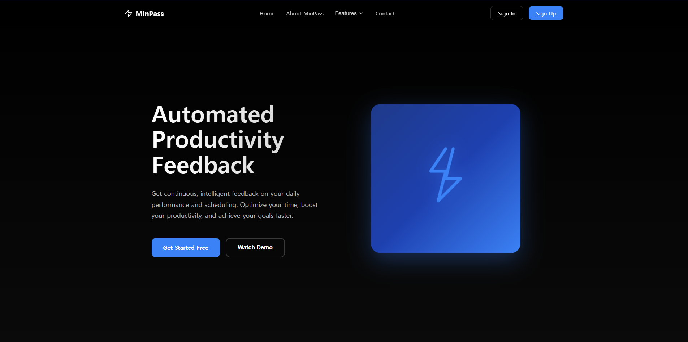
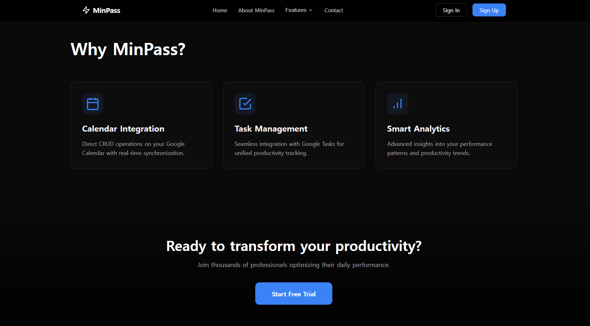

# 🧩 Frontend Page Specification - Landing Page

> **Objective**: Main landing page for MinPass service introduction and user acquisition  
> **Representatives**: Front-End | Designer | Back-End  
> **Version**: v1.0  
> **Last Updated**: 2025-11-10  
> **Author**: AI Assistant

---

## 1. Overview

| Items                    | Contents                                                                      |
| ------------------------ | ----------------------------------------------------------------------------- |
| **Page Name**            | Landing Page (Main Page)                                                      |
| **Route Path**           | `/`                                                                           |
| **Layout Type**          | Standalone (No shared layout, includes own Header)                            |
| **Description**          | Main landing page for service introduction, key features, and user conversion |
| **Author / Last Update** | AI Assistant / 2025-11-10                                                     |

---

## 2. Page Structure

```bash
LandingPage
 ├─ Header
 │   ├─ Logo (MinPass with icon)
 │   ├─ Navigation Menu
 │   │   ├─ Home
 │   │   ├─ About MinPass
 │   │   ├─ Features (Dropdown)
 │   │   │   ├─ Calendar
 │   │   │   ├─ Tasks
 │   │   │   └─ Ontology
 │   │   └─ Contact
 │   └─ Auth Buttons
 │       ├─ Sign In
 │       └─ Sign Up
 ├─ Hero Section
 │   ├─ Title ("Automated Productivity Feedback")
 │   ├─ Description
 │   ├─ CTA Buttons
 │   │   ├─ Get Started Free
 │   │   └─ Watch Demo
 │   └─ Visual Icon (Lightning bolt)
 ├─ Why MinPass Section
 │   ├─ Section Title
 │   └─ Features Grid (3 cards)
 │       ├─ Calendar Integration
 │       ├─ Task Management
 │       └─ Smart Analytics
 ├─ CTA Section
 │   ├─ Title ("Ready to transform your productivity?")
 │   ├─ Description
 │   └─ Start Free Trial Button
 └─ Footer
     └─ Copyright Notice
```

---

## 3. UI Components

| Component         | Role                                  | Related File                                    | Props / Interface | Related Module |
| ----------------- | ------------------------------------- | ----------------------------------------------- | ----------------- | -------------- |
| Header            | Navigation and authentication buttons | `src/widgets/header/ui/Header.tsx`              | -                 | useUserStore   |
| Hero Section      | Service introduction and primary CTAs | `src/pages/landing/ui/LandingPage.tsx` (inline) | -                 | -              |
| Feature Card      | Individual feature showcase cards     | `src/pages/landing/ui/LandingPage.tsx` (inline) | -                 | -              |
| CTA Section       | Bottom conversion section             | `src/pages/landing/ui/LandingPage.tsx` (inline) | -                 | -              |
| Features Dropdown | Header Features menu dropdown         | `src/widgets/header/ui/Header.tsx`              | -                 | React Router   |

---

## 4. Feature Specification

| Feature                   | Description                                                | Trigger / Event         | State Management | API Integration |
| ------------------------- | ---------------------------------------------------------- | ----------------------- | ---------------- | --------------- |
| Page Load                 | Render landing page                                        | Route entry             | -                | None            |
| Get Started Free Click    | Navigate to login page                                     | `onClick` → `/login`    | -                | None            |
| Start Free Trial Click    | Navigate to login page                                     | `onClick` → `/login`    | -                | None            |
| Features Menu Hover       | Display dropdown menu                                      | `onMouseEnter/Leave`    | Local state      | None            |
| Features > Calendar Click | Navigate to calendar page                                  | `onClick` → `/calendar` | -                | None            |
| Sign In / Sign Up Click   | Navigate to login page                                     | `onClick` → `/login`    | -                | None            |
| Logo Click                | Navigate to main page (current page)                       | `onClick` → `/`         | -                | None            |
| Auth State Check          | Display Logout button instead of Sign In/Up when logged in | Header render           | useUserStore     | None            |

---

## 5. Data Interface

```typescript
// No complex data structures - mostly static content
// User state is managed globally via Zustand

type User = {
  id: string
  email?: string
  name?: string
  isNewUser?: boolean
}

// Feature cards are hardcoded inline
interface FeatureCardData {
  icon: JSX.Element
  title: string
  description: string
}
```

---

## 6. Related Files

| Category       | File Path                                     | Description                       |
| -------------- | --------------------------------------------- | --------------------------------- |
| Page Component | `src/pages/landing/ui/LandingPage.tsx`        | Main landing page component       |
| Page Index     | `src/pages/landing/index.ts`                  | Page export                       |
| Styles         | `src/pages/landing/ui/LandingPage.module.css` | Landing page specific styles      |
| Header Widget  | `src/widgets/header/ui/Header.tsx`            | Shared header component           |
| Header Styles  | `src/widgets/header/ui/Header.module.css`     | Header styles                     |
| Header Index   | `src/widgets/header/index.ts`                 | Header export                     |
| User Store     | `src/entities/users/model/user.store.ts`      | Zustand user state management     |
| Router Config  | `src/app/routes.tsx`                          | Routing configuration             |
| Global Styles  | `src/app/styles/index.css`                    | Global styles (reset, dark theme) |

---

## 7. UX / UI Notes

### Design System

- **Color Scheme**: Dark theme (black background `#000`, blue accent `#3b82f6`)
- **Typography**:
  - Hero Title: 4rem (64px), bold
  - Section Title: 3rem (48px), bold
  - Body Text: 0.95-1.125rem, regular
- **Spacing**: Consistent section padding (6rem)

### Interactions

- **Hover Effects**: Smooth transitions (0.2-0.3s)
  - Buttons: translateY effect with shadow
  - Cards: translateY(-4px) with border highlight
- **Animations**:
  - Hero icon: pulse animation (3s loop)
  - Features dropdown: fadeIn animation (0.15s)

### Responsive Design

- **Desktop**: 1280px max-width container
- **Tablet (≤1024px)**: Vertical hero layout, grid → 1 column
- **Mobile (≤768px)**:
  - Hide header navigation
  - Full-width CTA buttons
  - Reduced text sizes

### Accessibility

- Semantic HTML tags (`<header>`, `<nav>`, `<section>`, `<footer>`)
- Keyboard navigation support (tab focus)
- Sufficient color contrast (WCAG AA compliant)
- Meaningful SVG icon structure

---

## 8. Dependency & Integration

| Item              | Description                                 |
| ----------------- | ------------------------------------------- |
| Global Store      | `useUserStore()` - Check login state        |
| Shared Components | Header widget reuse                         |
| Routing           | React Router DOM v7 (`Link`, `useNavigate`) |
| Styling           | CSS Modules (`.module.css`)                 |
| External Library  | None (Pure React + React Router)            |
| Backend API Spec  | N/A (Static page, no API calls)             |

---

## 9. Open Issues / TODO

| Item                      | Status     | Owner         | Notes                                |
| ------------------------- | ---------- | ------------- | ------------------------------------ |
| Watch Demo button feature | ⚪ Planned | Frontend Team | Connect demo video or tutorial       |
| About MinPass page        | ⚪ Planned | Frontend Team | Detailed service introduction page   |
| Contact page              | ⚪ Planned | Frontend Team | Contact form or information          |
| SEO meta tags             | ⚪ Planned | Frontend Team | title, description, OG tags          |
| i18n support              | ⚪ Planned | Frontend Team | Korean/English switching             |
| Mobile hamburger menu     | ⚪ Planned | Frontend Team | Navigation accessibility below 768px |

---

## 10. Change Log

| Version | Date       | Changes                                            | Author       |
| ------- | ---------- | -------------------------------------------------- | ------------ |
| v1.0    | 2025-11-10 | Initial creation - Hero, Why MinPass, CTA sections | AI Assistant |
| v1.0    | 2025-11-10 | Header component separation and Features dropdown  | AI Assistant |
| v1.0    | 2025-11-10 | Dark theme design implementation                   | AI Assistant |

---

## 11. References

### Design Inspiration

- Modern SaaS landing pages (Vercel, Linear, Notion)
- Dark mode best practices

### Technical Documentation

- [React Router DOM v7](https://reactrouter.com/)
- [CSS Modules](https://github.com/css-modules/css-modules)
- [Feature-Sliced Design](https://feature-sliced.design/)

### Internal Links

- Header Widget: `docs/2. Widgets/header.md` (TBD)
- Routing: `docs/0. Architecture/routing.md` (TBD)
- User Store: `docs/3. Entities/user-store.md` (TBD)

---

## 12. Screenshots & Visual Reference

### Hero Section



### Why MinPass Section




---

## 13. Testing Checklist

- [ ] Verify all links navigate to correct routes
- [ ] Confirm Features dropdown appears smoothly on hover
- [ ] Ensure dropdown menu persists during mouse movement
- [ ] Validate buttons change correctly based on login state
- [ ] Test responsive design on mobile/tablet devices
- [ ] Verify all animations run smoothly
- [ ] Confirm keyboard navigation works properly
- [ ] Ensure dark theme is consistently applied throughout
